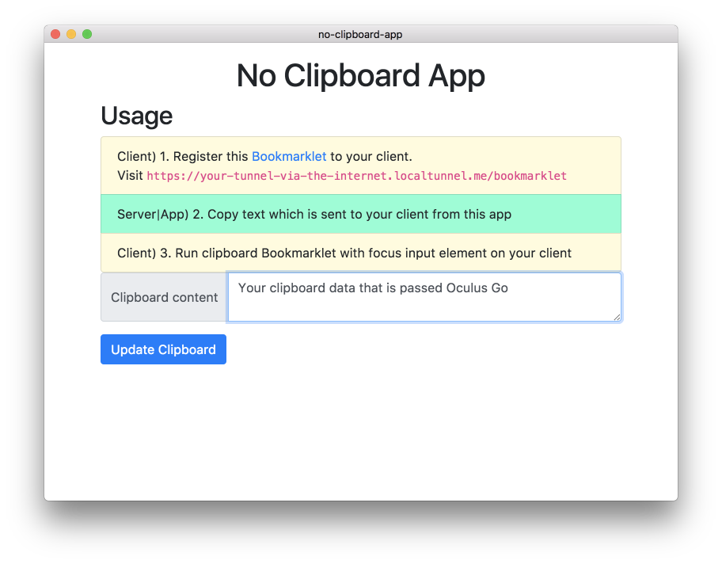

# No Clipboard app

This app help no-clipboard device like [Oculus Go](https://www.oculus.com/go/) to share clipboard your PC.

You can pass from your clipboard text on your PC to your device like Oculus Go.

> PC -> Device's browser

## Terminology

- Client: Recieve clipboard data from Server.
    - For example Oculus Go is Client.
- Server: Padd clipboard data to Client. This app includes the Server.
    - Your PC/mac is Server

**Client:**

**Server:**

## :warning: Note

This app share the clipboard data via [Localtunnel](https://localtunnel.github.io/www/).

> Client -> request -> [Localtunnel](https://localtunnel.github.io/www/) -> (local) Server.

[Localtunnel](https://localtunnel.github.io/www/)'s subdomain is randomized and it is hard to guess the url.
Potentially, Anyone can access your clipboard via the internet when running this Server/App.

## Installation

- Download app from [latest releases](https://github.com/azu/no-clipboard-app/releases/latest)

Currently, released binary is mac only.
But, you can run/build this app for your platform.

### Run app on local

    yarn
    yarn start

### Build app on local

    yarn
    yarn make

## Usage

1. Run app(This is a server)
    - Click "Open" on context menu
2. Register bookmarklet to your client
3. Focus `<input>` or `<textarea>` on your client's browser
    - This bookmarklet depended on [activeElement](https://developer.mozilla.org/en-US/docs/Web/API/DocumentOrShadowRoot/activeElement).
4. Run the bookmarklet in your client

### Bookmarklets

Current implementation of bookmarklets is [src/server/bookmarklet](src/server/bookmarklet).

- [copy-clipboard.js](src/server/bookmarklet/copy-clipboard.js)
- [go-to-clipboard.js](src/server/bookmarklet/go-to-clipboard.js)
- [paste-clipboard.js](src/server/bookmarklet/paste-clipboard.js)

If you have other bookmarklet idea, please send pull request.

Note: This **generated** bookmarket code include secret-key, you don not share it.

## Contributing

1. Fork it!
2. Create your feature branch: `git checkout -b my-new-feature`
3. Commit your changes: `git commit -am 'Add some feature'`
4. Push to the branch: `git push origin my-new-feature`
5. Submit a pull request :D

## License

MIT
